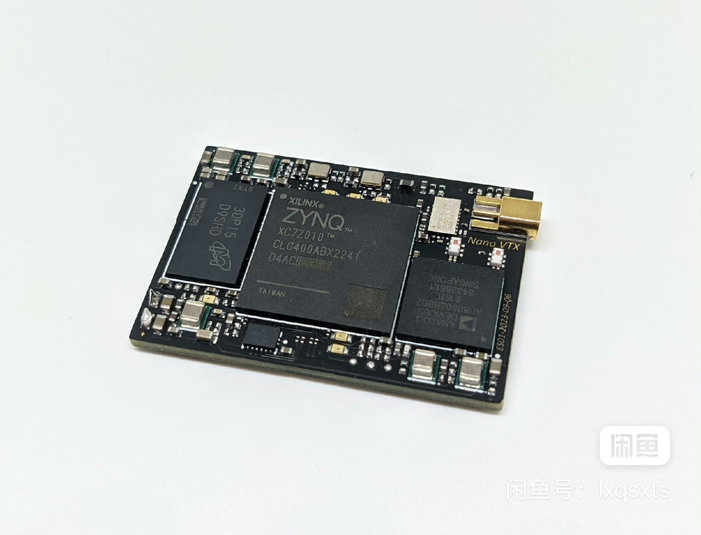
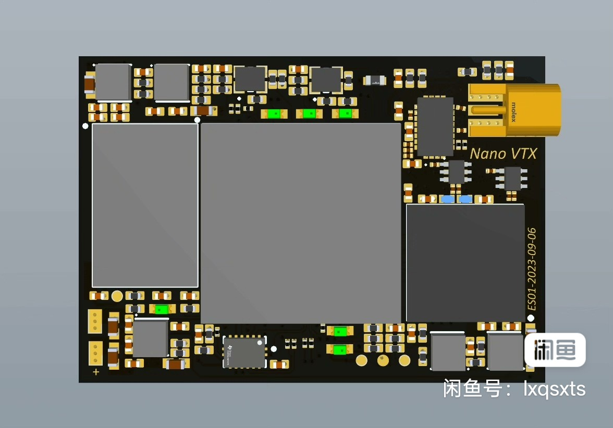
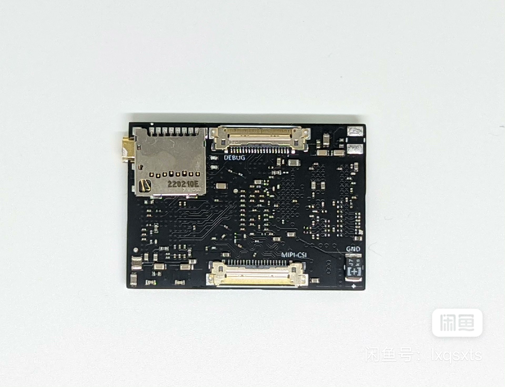

# nanoVTX

zynq7000 + ad936x Transeciver
Zynq AD9361图传模块硬件资料

Zynq7020 + AD9361 无线收发模块，TCXO时钟，512MB 1066Mbps DDR3内存，带有5.8G前端功放+LNA模块，尺寸仅3x4cm。

整板5V供电，运行功耗约1.5W，开启射频功放约2.5W。

上方排线引出了JTAG，串口以及部分io。可以测试时使用。
下方排线可以连接MIPI CSI2协议的摄像头，最多4lane，测试时使用了树莓派imx708。
本模块为收发一体，前端可时分复用收发，摄像头接口如有转接板也可连接屏幕，同一个模块可做接收端。

使用AD绘制。

---

## English Version

# nanoVTX

Zynq7000 + AD936x Transceiver
Zynq AD9361 Video Transmission Module Hardware Documentation

Zynq7020 + AD9361 wireless transceiver module, TCXO clock, 512MB 1066Mbps DDR3 memory, with 5.8G front-end power amplifier + LNA module, dimensions only 3x4cm.

The entire board is powered by 5V, operating power consumption is approximately 1.5W, with RF power amplifier enabled approximately 2.5W.

The upper ribbon cable exposes JTAG, serial port, and some IO pins — useful for testing.
The lower ribbon cable can connect cameras using the MIPI CSI2 protocol, up to 4 lanes; a Raspberry Pi IMX708 camera was used during testing.
This module is a transceiver in one unit; the front end supports time-division multiplexing for transmit/receive. With an adapter board, the camera interface can also connect a display, and the same module can serve as the receiver.

Designed using Altium Designer, manufactured with JLCPCB 6-layer ENIG process.
